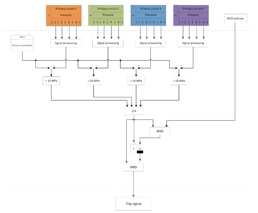

# Thesis_VTT_TU
My Master's thesis
Title: "model-to-model transformation of nuclear industry I&C logic to assist model checking"
Research fascilitated by VTT Technical Research Centre of Finland

This thesis provides a perception of various technologies relevant to broader authentication
process of a safety system covering from design to verification tools. The state-of-the-art modelchecking practice is discussed briefly. Subsequently, a number of logical instrumentation and
control diagrams, drawn in Microsoft VISIO tool, are analysed and processed to automatically
create an intermediate component network consisting of Function Block elements. A significant
effort is spent to partially generate NuSMV code from the retrieved component data to assist the
model checking of the system. Finally, the thesis is concluded with a synopsis of the work done
and future development scope.
Keywords: Model transformation, Microsoft VISIO, Nuclear power plant, Instrumentation and Control, Function Block Diagram, Formal verification, Model checking, NuSMV.

Used tools: Java, Regex, Graph-stream

In nuclear industry still generic drawing tools are in use to design instrumentation and control system and the design layout can be provided
as VISIO, PDF etc. This research was an attempt to transfer those I&C diagram and build a intermediate model accurately so that the retrieved
data can be integrated with qualified model checking tool. My responsibility was to demonstrate that it is possible to retrieve data from the 
non-standard diagrams in VISIO. The intermediate model is usable to generate NuSMV script. NuSMV is used for formal verification/model checking
where a system is defined finite state machine and requirements are defined for which the system must reach certain state. If there are any 
invalid state that would indicate that the system is violating the requirements. This process of formal verification is used for safety critical
system such as aeroplane, nuclear industry, integrated circuits etc.

The thesis file is uploaded in this repository "BiswasPrasun.pdf" where all the important steps are explained in details.

A short description is given using the following pictures.

 
 
 Figure: I&C diagram as VISIO file
 A number of I&C diagrams were provided. The diagram contained a variety of shapes that were not drawn following any standard. Those diagrams
 were read using Java language with apache.poi library.
 
 
 Figure: Example of decision diagram for initial shape sorting
 Certain number of classification rules were used to classify the data after analysis.
 
 
 
 
 Figure: Use of graph to cluster shapes and connections.
 
 Graph was used in many cases in this project. Example: shape classification, Intermediate model representation etc.
 
 
 
 Figure: Intermediate model representation with graph-stream
 
 The intermediate model can be used to generate NuSMV script to assist model-checking. In current practice the whole process follows manual steps
 where an analist redraw the I&C diagrams in a model-checking tool with graphical interface. The intermediate model could be used to integrate with
 the model checker by creating an importable file of the software.
 
  
  
  
  Figure: NuSMV script creation from the 
  
  This proof of concept for the completion of my thesis at VTT. 
  Supervisors: Dr. Eric Coataner (Tampere University) and Dr. Valeriy Vyatkin (Aalto University)
 
 
